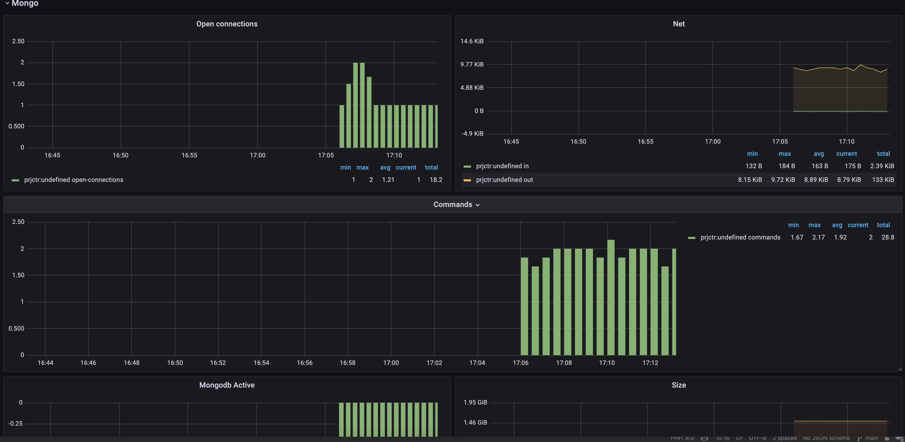
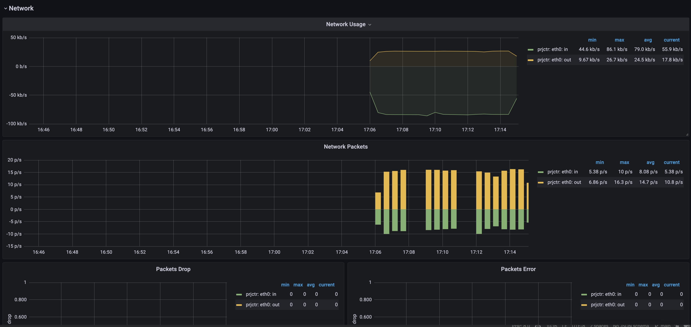
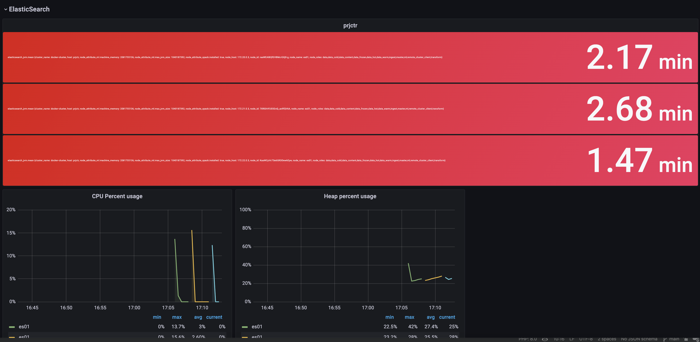
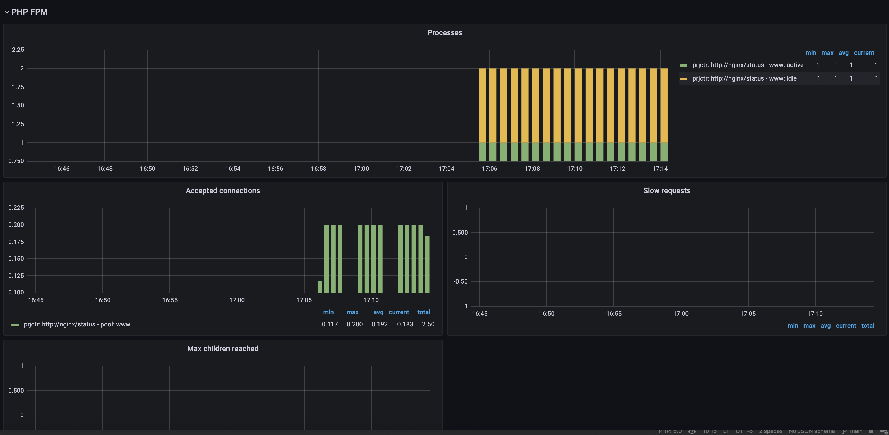
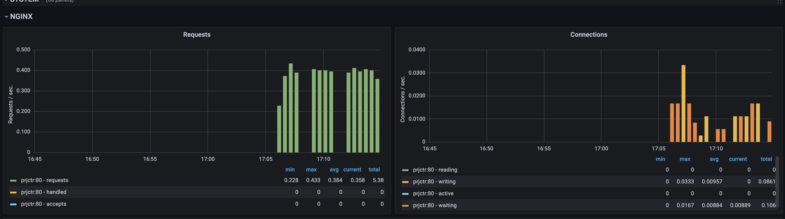

# basic-tig-nginx-php-mongo-elasticsearch

### Basic example project to show the TIG (Telegraf, InfluxDB and Grafana) stack with php-fpm, mongo, nginx, elasticsearch
Screenshots of the project:

